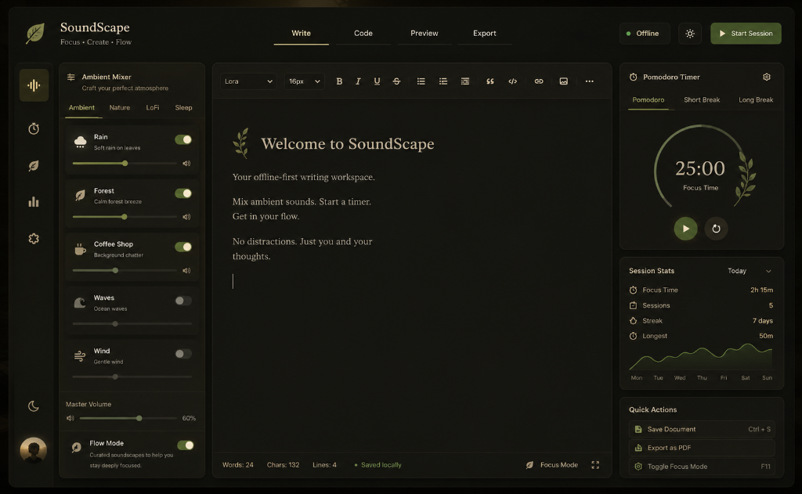

# SoundScape 🎧🍃

<div align="center">
  <p><strong>A Next-Generation Ambient Focus Suite, Web Audio Synthesizer, & Productivity Workspace</strong></p>

  [](https://vercel.com)
  [](https://developer.mozilla.org/en-US/docs/Web/API/Web_Audio_API)
  [](https://fastapi.tiangolo.com)
  [](https://opensource.org/licenses/MIT)
</div>

---

SoundScape is a premium, offline-first productivity workspace combining mathematical sound synthesis, dynamic environment synchronization, and gamified progress tracking. Whether writing novels, compiling scripts, or annotating research papers, SoundScape wraps your workspace in a gorgeous, eye-friendly cream parchment interface designed to keep your mind locked in deep flow.

---

## 🚀 Key Architectural Pillars

### 1. 🎛️ Physical Audio Synthesis & Soundboards
*   **Generative Wind Chimes:** Procedurally models clamped metal tube resonances using Web Audio oscillators. Features fundamental pitches in a pentatonic scale and inharmonic overtones (`1.0`, `2.76`, `5.40`, `8.93`) with natural ring-outs.
*   **Procedural Bird Chirps:** Synthesizes random forest tweets on-the-fly using exponential frequency sweeps (`2600Hz` to `3900Hz`) to create organic, non-repeating nature soundscapes.
*   **Binaural beats:** Mathematical carrier wave sweeps for Delta, Theta, Alpha, and Beta brainwave states to stimulate focus, active calculation, or deep sleep.
*   **IndexedDB Loop Uploader:** Drag and drop custom `.mp3` or `.wav` ambient files. Saved locally to browser IndexedDB memory to create infinite personal mixing desks.

### ⌨️ 2. Web Audio Mechanical Keyboard Engine
An immersive sound synthesizer triggering key strike click and spacebar clacks directly inside the browser Web Audio graph:
*   **Typewriter:** Classic metallic strike clicks with return bell chimes on Enter.
*   **Cherry MX Blue:** High-pitched, clicky spring snaps and hollow case slides.
*   **Gateron Brown:** Soft, rounded tactile bottom-outs for quiet workspaces.
*   **NK Cream:** Deep, thuddy wooden-casing clacks for linear enthusiasts.
*   **Raindrops:** Clean, liquid pop droplets for a relaxing typing rhythm.

### 🎮 3. Focus Quest RPG Sidebar
Turn writing and coding milestones into retro RPG progress:
*   **Animated Knight Hero:** Smooth SVG vector sprite walks, bounces, and attacks on your sidebar.
*   **Loot & XP Economy:** Earn gold coins and experience points per word written or focus minutes accumulated.
*   **Log Console:** Tracks slayed monsters (like *Syntax Slimes* or *Distraction Bugs*), level-ups, and game events. Progress is stored persistently in `localStorage`.

### 🌤️ 4. Dynamic Time-of-Day Sync
An automated environmental scheduler synced to your local clock:
*   *Morning (6AM - 12PM):* Light Theme, Leaf Shadow wall backdrop, 30% Forest Birds.
*   *Afternoon (12PM - 5PM):* Light Theme, Solid layout, 25% Lofi Study Beats.
*   *Evening (5PM - 8PM):* Dark Theme, Sunset wallpaper, 30% Lofi + 15% Forest Birds.
*   *Night (8PM - 6AM):* Dark Theme, Rainy window cabin wallpaper, 35% Rain & Thunder.

### 🎨 5. Dev Mode: CSS Customizer Sandbox
*   Paste custom CSS variables to skin your notepad, buttons, or backgrounds.
*   Instantly compiles and injects layout properties with local persistence and a one-click reset safety net.

---

## 📂 Repository File Structure

```
soundscape/
├── main.py                     # FastAPI application endpoints
├── database.py                 # SQLite database config and connection mapping
├── models.py                   # SQLAlchemy note & session schemas
├── static/
│   ├── index.html              # Layout structure, SVG sprite assets, drawers
│   ├── css/
│   │   └── styles.css          # Creamsepia overrides, customizer variables, keyframes
│   ├── js/
│   │   ├── audio.js            # Web Audio synthesizers, partial formulas, frequency sweeps
│   │   ├── stats.js            # Chart.js weekly summary metrics
│   │   └── app.js              # RPG logs, outline parser, IndexedDB uploader
│   └── images/
│       ├── cozy_cafe.jpg       # Neon-free ambient cafe study corner
│       └── light_shadow.jpg    # Default leaf shadow wall wallpaper
└── requirements.txt            # Python dependencies
```

---

<div align="center">
  <h3>🌌 Premium Dark Mode Study Workspace</h3>
  
</div>

---

## ⚡ Quick Start

### 1. Installation
Clone the repository and install backend modules:
```bash
git clone https://github.com/SaiVardhan337/SoundScape.git
cd SoundScape
pip install -r requirements.txt
```

### 2. Start Local Server
Launch the development engine:
```bash
uvicorn main:app --reload
```
Navigate to **[http://127.0.0.1:8000](http://127.0.0.1:8000)** in your browser.

*All notes, markdown logs, and stats will automatically save locally to `soundscape.db` inside your workspace.*

---

## 🤝 Contributing & Pull Requests
SoundScape is open source! Feel free to copy-paste custom CSS styles in our CSS Customizer drawer, build custom themes, or submit pull requests to add new synthesizer waveforms. If you love the project, please leave a star! ⭐

